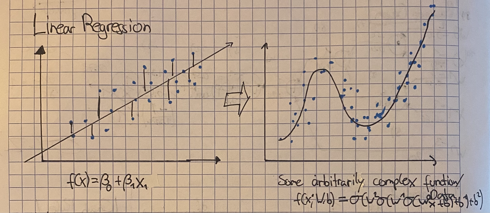
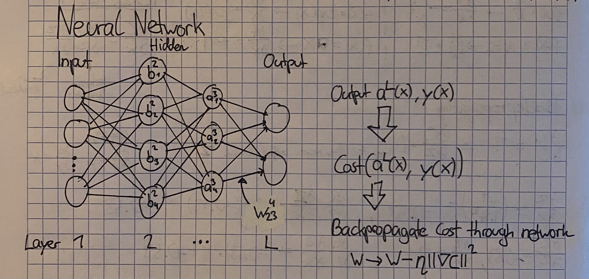

# Simple Neural Network

*This text is inspired by chapters 1 & 2 of Michael Nielsens free online book [Neural Networks and Deep Learning](http://neuralnetworksanddeeplearning.com/chap1.html). I recommend checking it out if you want more detailed descriptions.*

This document should help explain the basic concepts of how a neural network works and give you a better understanding how the [implementation](src/simple_network/simple_network.py) works.

**Topics covered**

- Neural Network description
- Neural Network Architecture
- Gradient Descent, why it works
- Backpropagation

## Neural Networks description

Okay, so you probably already know that you can fit a line to some points using linear regression.

Now, only fitting a line is not very useful in the real world, since most data is not linear. Neural networks help us fit more complex functions to data.
Thats where neural networks come in. They are able to fit arbitrarily complex functions to data, given enough neurons and training time. Really, neural networks are just function approximators.

## Architecture

A neural network is a function that looks like this (for one with three layers):
$$
f(x; W,b) = \sigma(w² \sigma(w¹  \sigma(w⁰x + b⁰) + b¹) + b²)
$$
It consists of Input layer, one or more hidden layers and an output layer. Each layer consists of neurons, which are connected to the neurons in the previous layer via weights. Each neuron also has a bias term.

We don't count the input layer as a layer, since it does not do any computation, it just passes the input to the next layer.

- $w_{jk}^l$ Weight connecting neuron $k$ in layer $l-1$ to neuron $j$ in layer-$l$
- $b^l_j$ Bias of neuron $j$ in layer-$l$
- $a^l_j$ Activation of neuron $j$ in layer-$l$ (Output of activation function)

## Gradient Descent, why it works

To find the weights and biases that minimize the cost function we use Gradient Descent.

At the start, all the parameters of the network are random, we now need an update rule to change the parameters in a way that the output of the network gets closer to the expected output.

It can be said that in an example with two parameters $w_1, w_2$ a change in the cost function $C$ can be approximated as:

$$
\begin{align}
\Delta C &\approx \frac{\partial C}{\partial w_1} \Delta w_1 + \frac{\partial C}{\partial w_2} \Delta w_2 \\
\end{align}
$$

We now want to choose $\Delta w = (\Delta w_1, \Delta w_2)^T$ as to make $\Delta C$ negative, so that the cost function decreases.

If we have $\nabla C = ( \frac{\partial C}{\partial w_1},  \frac{\partial C}{\partial w_2})^T$ then 1) can be rewritten as:

$$
\Delta C  \approx \nabla C \cdot \Delta w
$$

Now if we choose to adjust the parameters like $\Delta w = -\eta \nabla C$ and some  small $\eta > 0$ (the learning rate) we get:

$$
\Delta C \approx -\eta ||\nabla C||^2
$$

And since $||\nabla C||²$ will always be positive, the $\Delta C$ will always be negative, and the cost function will decrease.

And so we have our update rule for $w$ :

$$
v \rightarrow w' = w - \eta \nabla C
$$

And this works for any number of parameters, not just two and so we can apply it to our neural network.

However, note that this guarantee would only hold for infinitesimally small learning rate $\eta$. In practice we have to choose a larger learning rate, which can lead to situations where the cost function actually increases. Furthermore, this only leads to the global minimum if the cost function is convex, which is not the case for neural networks.

## Backpropagation

Now our goal is to minimize this function with respect to a Cost/Loss function. In our MNIST example this is simply the Squared Error

$$
C = \frac{1}{2n}\sum_x ||y(x) - a^L(x)||
$$

Where $y(x)$ is the expected output, $a^L(x)$ is the output of our network (the networks last activation layer) and $||x||$ is the Euclidean Norm.
We use $2n$ so that the derivative of the individual cost $C_x$ becomes a bit nicer and it does not affect the optimization since the cost is just scaled by a factor.

$$
C_x = \frac{1}{2}||y(x) - a^L(x)|| \quad \quad \frac{\partial C_x}{\partial a^L}=a^L(x)-y(x)
$$

To make the update step, we need to compute the gradients $\frac{\partial C_x}{\partial w_{jk}^l}$ for all weights and biases.

And so basically what we are doing is, we want to find out how much each weight is responsible for the error in the output, and then change the weights throughout to reduce that error.

### 4 Rules for Backpropagation

There are four steps to performing backpropagation, which we will denote as 1BP, 2BP, 3BP and 4BP.

#### 1BP - Error in the output layer

For the last layer of the network, we can calculate the derivatives directly using the chain rule, we know everything we need:

$$
\begin{align}
\frac{\partial C}{\partial z^L} = \frac{\partial C}{\partial a^L} \frac{\partial a^L}{\partial z^l} = \nabla_a C \odot \sigma'(z^L) = (a^L -y) \odot \sigma'(z^L)
\end{align}
$$

#### 2BP - Backpropagate the error

For the other layers, we can use the chain rule again to express the error in layer $l$
We do this by moving the error backwards through the network, by taking the error in layer $l+1$ and multiplying it by the weights connecting layer $l$ to layer $l+1$.
So if a node has a high error in layer $l+1$ and is strongly connected to a node in layer $l$, then that node in layer $l$ should also have a high error.

So tl;dr we propagate $\frac{\partial C}{\partial a^{l+1}}$ to the previous layer via $(w^{l+1})^T$

$$
\begin{align}
\frac{\partial C}{\partial z^l} = \left ( (w^{l+1})^T \ \frac{\partial C }{\partial z^{l+1}} \odot \sigma '(z^l) \right)
\end{align}
$$

#### 3BP - Gradient wrt. biases

The gradient wrt. biases is equal to the error in that layer, since it is just added to the weighted sum of inputs.

In  4BP you will notice, that the gradient wrt. weights also contains the activation from the previous layer. If you think about the bias as just another input/activation from the previous layer that is always equal to 1, you can see why it is equal to the error.

$$
\begin{align}
\frac{\partial C}{\partial b_j^l} = \frac{\partial C}{\partial z_j^l} \cdot 1 = \frac{\partial C}{\partial z_j^l}
\end{align}
$$

#### 4BP - Gradient wrt. weights

Finally, the gradient wrt. weights is equal to the error in that layer multiplied by the activation from the previous layer.
Conceptually, if the error in layer $l$ is high, and the activation in the previous layer is high, then we want less of that signal to pass through that weight, so we decrease the weight.

$$
\begin{align}
\frac{\partial C }{\partial w_{jk}^l} = \frac{\partial C}{\partial z_j^l} \cdot a_k^{l-1}
\end{align}
$$

## Implementation

To make one updates to the weights and biases of the network, we do the following steps:

1. Compute forward pass though the network, store activations $a$ and weighted inputs $z$
2. Perform backpropagation to compute gradients for all weights and biases. Do this for each training example.
3. Compute the average gradient over the training examples.
4. Update weights and biases using the average gradients and the learning rate $\eta$ according to the update rule.

**Gradient Descent** computes the average gradient over all training examples that we have. However, this can be impractical for large datasets, since it requires a lot of memory and computation time.

**Stochastic Gradient Descent (SGD)** instead computes the average over a small randomly sampled subset of the training data, called a batch. This is much more efficient, since we can do multiple updates per epoch. This is how it is done in  [the implementation of a simple neural network using SGD](src/simple_network/simple_network.py)
